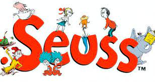
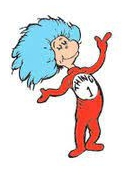
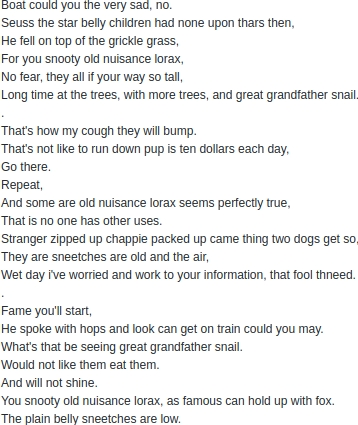
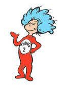
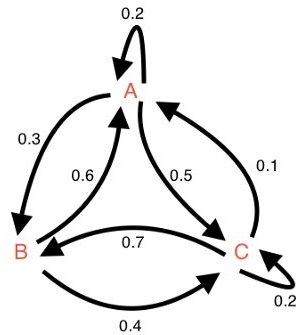
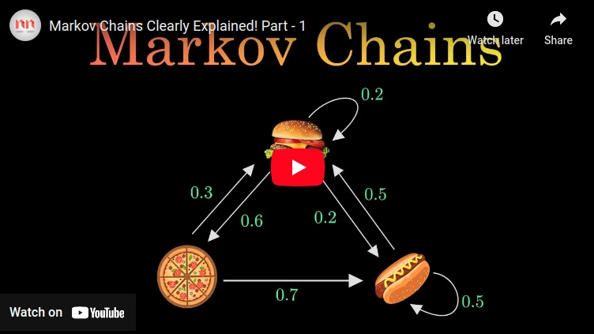

#   **Flavored Markov**  

  
   
  

    
## &emsp; **A Peek Into How Markov Works**

    

&emsp; A Markov chain or Markov process is a *theoretical model describing a sequence of possible events in which the probability of each event depends only on the state attained in the previous event*. Informally, this may be thought of as, <strong>What happens next depends only on the state of affairs now.</strong> Markov chains have many applications as statistical models of real-world processes. They are the basis for general theoretical simulation methods and have found application in a wide variety of feilds. 

&emsp; By convention, all possible states and transitions have been included in the definition of the process, so **there is always a next state, and the process does not terminate**. The transitions are often thought of as moments in time, but they can equally well refer to any other discrete measurement. The transitions are the integers, and the random process is a mapping of these states.  

&emsp; Since **the system changes randomly, it is generally impossible to predict with certainty the state of a Markov chain at a given point in the future.** However, the statistical properties of the system's future can be predicted. In many applications, it is these statistical properties that are important.

 

   

    

