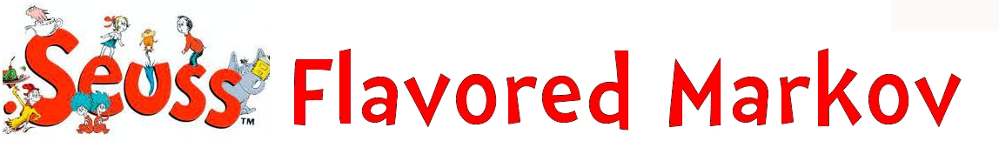
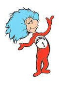
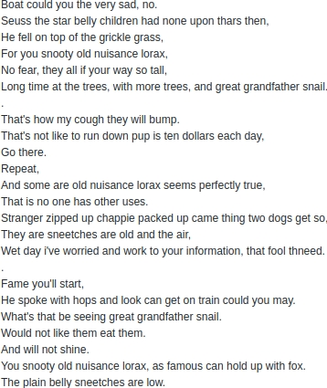
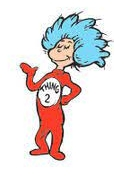
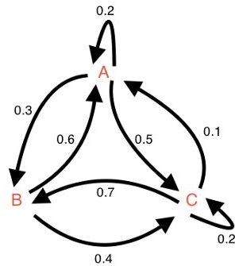
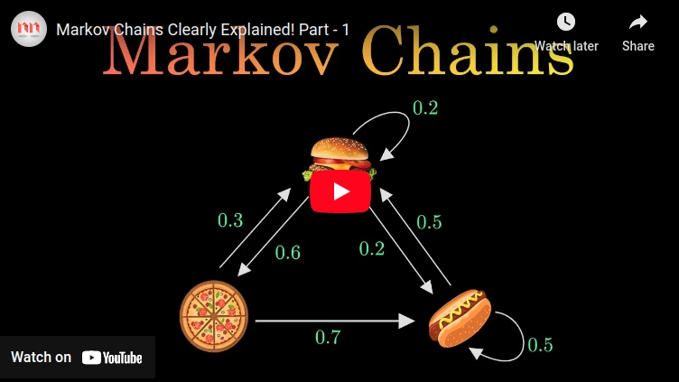
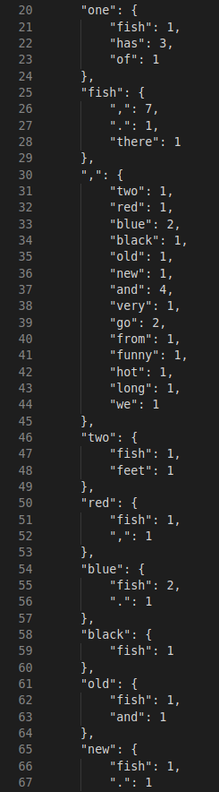
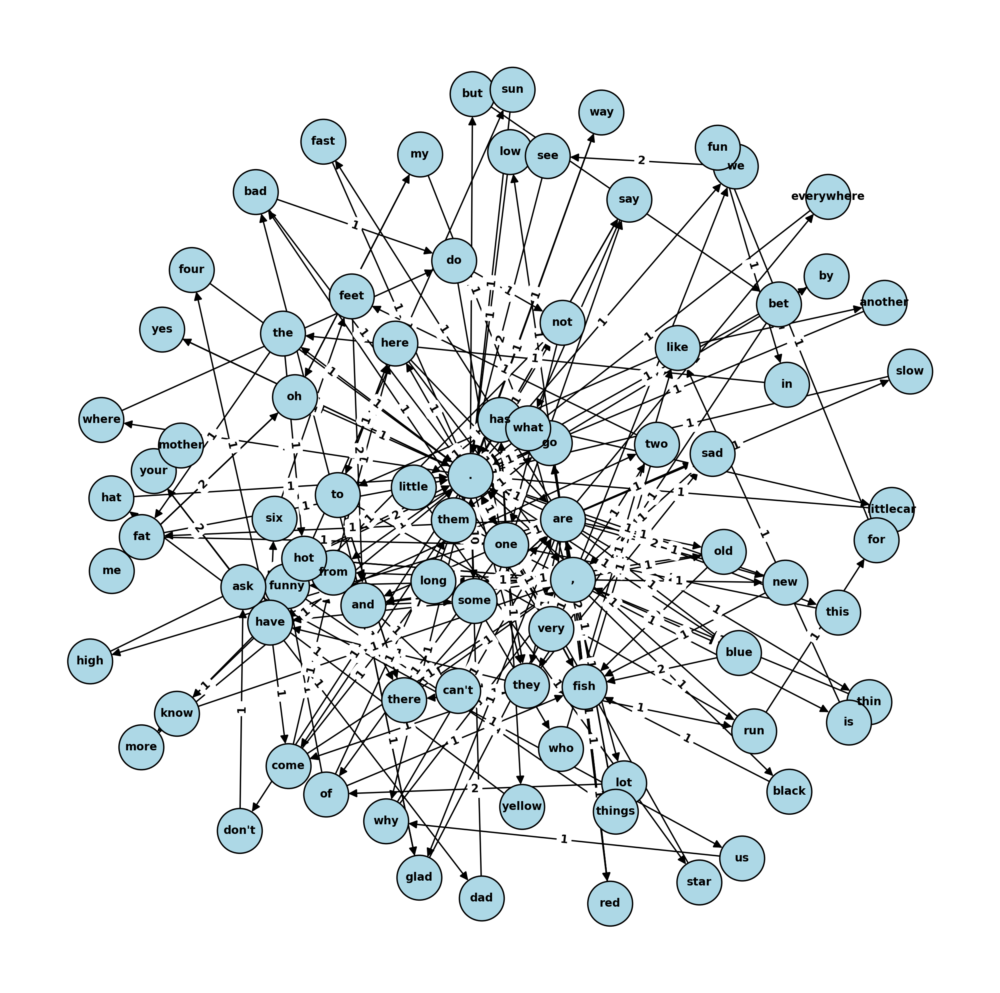

  

___

  
    
  

 

 This is an example of exact output. All formatting is done with python and is written into the code. *More in depth explanation further* [below.](#explanation) 

   

## &emsp; **A Peek Into How Markov Works**

    

&emsp; A Markov chain or Markov process is a *theoretical model describing a sequence of possible events in which the probability of each event depends only on the state attained in the previous event*. Informally, this may be thought of as, <strong>What happens next depends only on the state of affairs now.</strong> Markov chains have many applications as statistical models of real-world processes. They are the basis for general theoretical simulation methods and have found application in a wide variety of fields. 

&emsp; By convention, all possible states and transitions have been included in the definition of the process, so **there is always a next state, and the process does not terminate**. The transitions are often thought of as moments in time, but they can equally well refer to any other discrete measurement. The transitions are the integers, and the random process is a mapping of these states.  

&emsp; Since **the system changes randomly, it is generally impossible to predict with certainty the state of a Markov chain at a given point in the future.** However, the statistical properties of the system's future can be predicted. In many applications, it is these statistical properties that are important.

 

   

   

## Explanation
### **Brief break down of the nuances of my code.**

&emsp; First, we start with importing text to train our model. This is especially fun because you can **use any text input you want.** Since I choose more of a lyrical text, I decided I wanted to keep contractions and, for output readability, discard all single letter words. Also, I left in commas and periods to help preserve sentence structure. Took forever, but I finally got the regex correct.

 For those curious kids watching at home, the regex is r'[.,]|[a-z]+[']?[a-z]+'

##### Delving deep and almost losing my self in python's deep nested dictionaries. That almost broke my brain. 

&emsp; Iterating over each word in a text, calculating and storing every word that follows it throughout the text and how many times that same patter occurs  subsequent word and the amoutnt of time  that exact the total amount of times each word follows another word in a given text
iterating over a text while recording and tallying the amount of times each word follows another  taking a given text and calculating the amount of time a word follows another word. 
in a given text, it iterates over ever every word, recording each subsequent word and tallying the rate in witch that same pair occurs
 those words int that order occurrence each  word over the entirety text and tallying the rate off occurrence.  

&emsp; So, let's make the starting word as the first key in our dictionary, the next word becomes a nested key under the first word with the value being one
hen we do it over and over again until we get to the end,
 

 
   
 

  